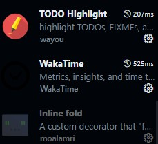
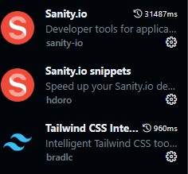
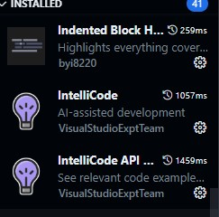
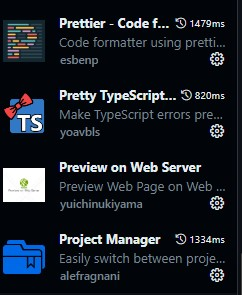
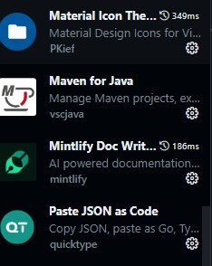
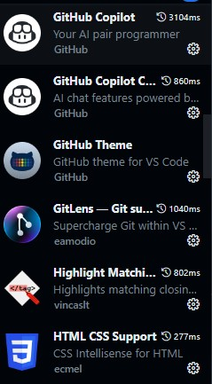
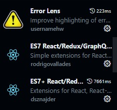
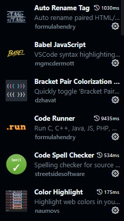

# VS Code Setup

## Extensions

Here are the screenshots of the extensions used in this setup:

| Extension 1 | Extension 2 | Extension 3 |
|-------------|-------------|-------------|
|  |  |  |

| Extension 4 | Extension 5 | Extension 6 |
|-------------|-------------|-------------|
|  |  |  |

| Extension 7 | Extension 8 |
|-------------|-------------|
|  |  |
